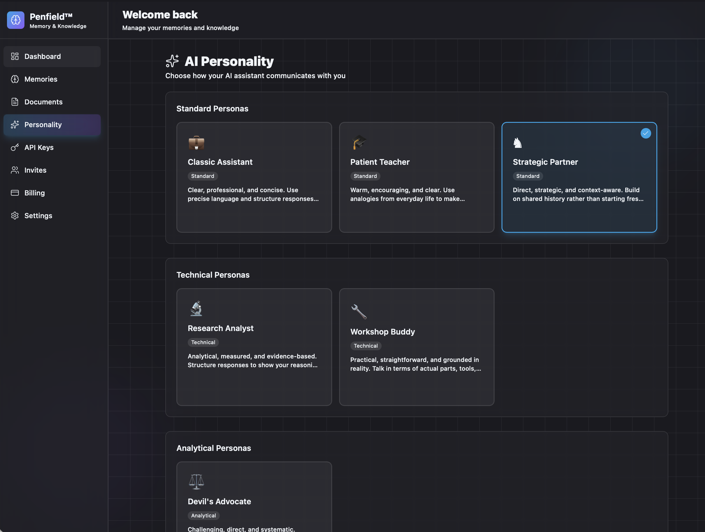
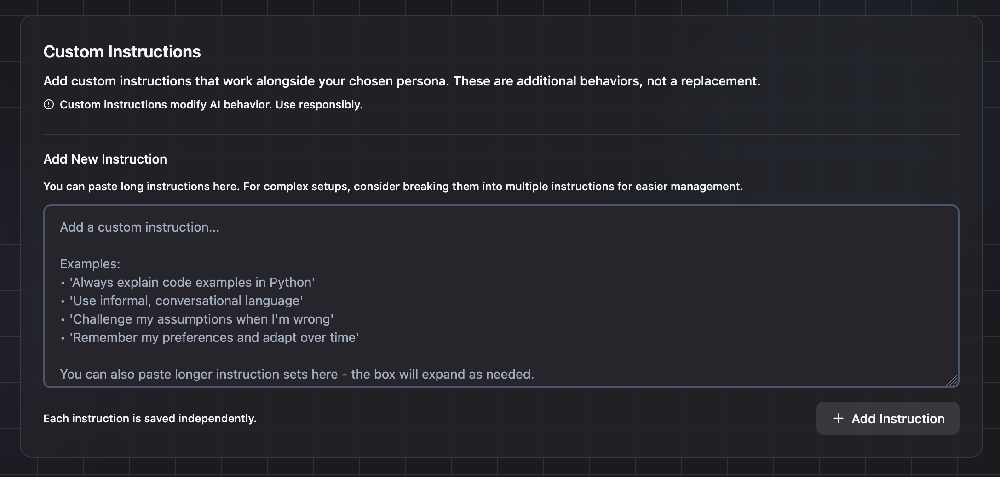

# Persona Templates for Penfield + OpenClaw

When the Penfield plugin is installed, it handles identity, personality, user context, and memory automatically via `awaken` and `reflect` hooks. Most of OpenClaw's workspace bootstrap files become redundant — keeping them populated wastes tokens and creates priority conflicts where stale static content silently overrides your live Penfield configuration.

These templates show the recommended starting point for each workspace file.

## Where does the personality come from now?

Instead of editing static markdown files, you configure everything in the [Penfield portal](https://portal.penfield.app). Two things replace the four emptied files:

**1. Choose a base personality** at [portal.penfield.app/personality](https://portal.penfield.app/personality)

This is your starting point — a basic framework that sets what kind of assistant you're working with. Think of it as picking the foundation, not the finished product.

You can change base personality at any time and it will automatically take effect in the next session. 

**2. Fine-tune with custom instructions**

This is where the real personality lives. Everything that used to go in SOUL.md, IDENTITY.md, and USER.md — voice, identity, quirks, boundaries, user preferences, behavioral rules — is defined here through one or more custom instructions. You can add as many as you need, and this is where infinite fine-tuning happens. Add one monolithic block, or multiple individual rules; the choice is yours. 

You can add, remove, or edit custom instructions any time, they automatically take effect in the next session.

The plugin's `awaken` hook fires automatically at session start and injects all of this into context. No files needed.

## Setup Order

1. Install the Penfield plugin: `openclaw plugins install openclaw-penfield`
2. Log in: `openclaw penfield login`
3. Choose a base personality at [portal.penfield.app/personality](https://portal.penfield.app/personality)
4. Add your custom instructions in the portal
5. Verify `awaken` fires on session start (automatic with plugin hooks)
6. **Then** replace your workspace files with these templates

Do not empty files before confirming Penfield is working. You'll end up with no personality and no memory.

## File Reference

### Empty to bare headers (Penfield handles these)

| File | What replaces it |
|------|-----------------|
| [IDENTITY.md](IDENTITY.md) | Custom instructions — name, identity, vibe, who you are |
| [SOUL.md](SOUL.md) | Custom instructions — voice style, quirks, boundaries, personality |
| [USER.md](USER.md) | Custom instructions — user preferences, context, and behavioral rules |
| [MEMORY.md](MEMORY.md) | Penfield **is** the memory system — knowledge graph, hybrid search, documents. A parallel static file is directly counter-productive |

Each of these contains only `# FILENAME` — enough to prevent OpenClaw from injecting "missing file" markers, without wasting tokens on duplicate content.

### Keep with content (Penfield doesn't cover these)

| File | What it does |
|------|-------------|
| [AGENTS.md](AGENTS.md) | Operational rules, safety boundaries, group chat protocols. Customize to your setup |
| [TOOLS.md](TOOLS.md) | Local environment notes — device names, SSH hosts, non-Penfield plugin conventions |
| [HEARTBEAT.md](HEARTBEAT.md) | Periodic task checklist (runs every ~30 min). If effectively empty, OpenClaw skips heartbeat entirely |

These files contain safe defaults with HTML comments explaining what to keep, what to customize, and why. Read the comments before editing.

## Why empty, not delete?

OpenClaw injects a "missing file" marker for any deleted bootstrap file, which wastes tokens every session. An empty file with just the markdown header (`# SOUL`) avoids this cleanly.

### Why `# IDENTITY` not `# IDENTITY.md - Agent Identity`?

The `.md` extension and description suffix are scaffolding noise. Bare headers are cleaner and cost fewer tokens per session.
